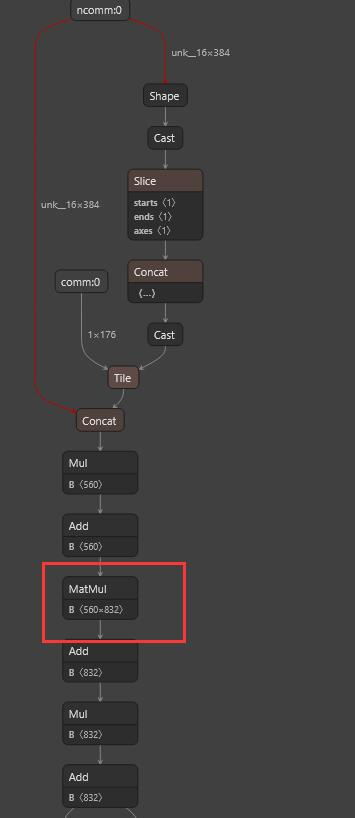

运行方式

```
chmod 777 /root/cuda_10.2.1_linux.run
./cuda_10.2.1_linux.run
accpet
//依次执行三个命令，然后install
```

```
chmod 777 /root/cuda_10.2.2_linux.run
./cuda_10.2.2_linux.run
accpet
//依次执行三个命令，然后install
```


```
 bash init.sh 
```

初始化环境，这一步是服务器重新启动的时候必须做的一步，只需要在服务器重启之后执行一次 

```
bash Build.sh
```

编译代码，其中在model.cc 存在参数是否开启FP16优化以及INT8优化，默认使用FP16优化 INT8可以运行，但是量化误差比较大，并且实际测试速度没有FP16快,目前还未找到原因(问了一个大佬，tensorrt版本太低，唉！！！！)

```
bash run.sh 
```
在benchmark_conf里面定义了sample_file,baseline_file与result_file

sample_file输入数据地址

baseline_file为正确结果文件地址

result_file为输出文件地址

运行代码，在warmup阶段进行量化误差 

请注意，由于onnx ---> trt 时间比较长， 

程序会先判断是否存在model.trt，如果存在的话，那么直接读取model.trt文件，不存在，进行onnx ---> trt 过程 

如果测试了FP16之后，想要测试INT8的效果，那么请将blaze-benchmark目录下的model.trt删除，重新编译运行。


2023-7-10 

完成tensorflow ---> onnx ---> trt 动态推理 FP16 FP32 

导出命令： 

```
python -m tf2onnx.convert --graphdef frozen_graph_origin.pb --inputs comm:0 --outputs output:0 --opset 11 --output model.onnx
```

 2023-7-11 

完成trt consumer的实现,改写了推理池逻辑，使用队列进行实现

 trt 单线程 1700

 trt 推理池逻辑，使用队列进行实现 单线程 2200-2400不等 

2023-7-15 完成了误差计算，

这里计算的是相对误差平均值

| trt               | 相对误差     | 速度 |
| ----------------- | ------------ | ---- |
| FP16              | 0.2%         | 2300 |
| FP32              | 0.000132406% | 2014 |
| 固定尺寸推理+FP16 | 0.294638%    | 4673 |

 2023-7-16 计算误差有问题，重新计算，99%的数据量的不超过1%相对误差，

| trt                    | 相对误差     | 超过1%相对误差的数据占比 | 速度  |
| ---------------------- | ------------ | ------------------------ | ----- |
| FP16                   | 0.2%         | 0.0%                     | 2300  |
| FP32                   | 0.000132406% | 0.0%                     | 2014  |
| 固定尺寸推理+FP16*     | 0.294638%    | 0.0%                     | 4673  |
| FP16+设置最优推理尺度* | 0.294638%    | 0.0%                     | 5300+ |
| INT8                   | 8.1867%      | 0.0%                     | 4000+ |

   分析带\*的主要提升是在于在推理器进行初始化的时候， 我们在model.h/PredictContext的构造函数中生成最大显存， 这样每次使用该推理器的时候就不会重复申请和释放显存了 并且每个推理器都使用自己的内存区域，不会出现线程互斥的问题 在析构函数里面释放了显存，防止内存泄露。 

2023-7-16 

查看很多tensorrt官方文档，官方不建议使用多线程的tensorrt推理，建议使用多 batchSize的推理 

github 上面有大佬做过对比试验 

https://github.com/axxx-xxxa/Yolo-deploy-framework.git 

发现多线程不能提高推理的效果 

我们为了兼容显卡驱动，使用tensorrt7.2.1.6，到官方的github去提问，也是让先使用tensorrt8.6 

我们也尝试安装tensorrt8.6和cuda11.2,cudann8.6 但是在onnx ---> trt 会报错，并且比赛快要结束，害怕破坏整个环境，没有继续深入修改liunx环境 

其实，关于多线程推理，网上的资料很少，我们也是按照官方提供的生产者和消费者去更改的。

 https://docs.nvidia.com/deeplearning/tensorrt/archives/tensorrt-803/best-practices/index.html#thread-safety 

按照Tensorrt官方的文档,Tensorrt的builder生成的context是线程不安全，于是我们对于每一个PredictContext都去使用不同的builder，并且使用的context都是用不同的builder生成的，但是还是推理速度没有任何提升。目前问题卡在这里了。 

2023-7-16 睡觉之前看了一眼文档，发现仅enqueue/enqueueV2 异步接口支持多线程，但是我一直使用的是execute/executeV2,修改之后发现单线程从5300 ---> 5500了,多线程 2700 ---> 3500 说明在tensorrt内部推理的过程中，存在资源的互斥现象。

| trt                            | 相对误差     | 超过1%相对误差的数据占比 | 速度  |
| ------------------------------ | ------------ | ------------------------ | ----- |
| FP16                           | 0.2%         | 0.0%                     | 2300  |
| FP32                           | 0.000132406% | 0.0%                     | 2014  |
| 固定尺寸推理+FP16*             | 0.294638%    | 0.0%                     | 4673  |
| FP16+设置最优推理尺度*         | 0.294638%    | 0.0%                     | 5300+ |
| INT8                           | 8.1867%      | 0.0%                     | 4000+ |
| FP16+最优尺度+enqueueV2        | 0.294638%    | 0.0%                     | 5500+ |
| FP16+最优尺度+enqueueV2+多线程 | 0.294638%    | 0.0%                     | 3500+ |

2023-7-18 计算误差全部有问题，这就很烦的了

FP16的计算误差在16% 以上 

查找文档以及使用nsys 分析GPU的使用情况，会发现四个线程中的算子非常稀疏 


之后通过安装cuda10.2的插件，解决这个问题，多线程比单线程快很多 ,如下图所示，在线程进行推理，这个算子是密集的，因此速度提升巨大。


**FP32 2700 ---> 3500**     

**FP16 5500 ---> 9800 量化误差 16%，全局相对误差0.6%**  

2023-7-19 

今天还是查看为啥FP16的计算误差这么大的 

tensorrt 提供了一个工具 polygraphy 可以逐层用来分析onnx 与 trt 精度问题

首先polygraphy的FP32 推理是完成没有问题的。 

```
polygraphy run /content/model.onnx \

  --onnxrt --trt \

  --workspace 100000000 \

  --save-engine=model_FP16.plan \

  --atol 1e-2 --rtol 1e-2 \

  --fp16 \

  --verbose \

  --onnx-outputs mark all \

  --trt-outputs mark all \

  --trt-min-shapes 'ncomm:0:[511,384]' \

  --trt-opt-shapes 'ncomm:0:[511,384]' \

  --trt-max-shapes 'ncomm:0:[511,384]' \

  --input-shapes 'ncomm:0:[511,384]'
```

而使用FP16进行推理的时候，在一个fc1_dqm/MatMul这个矩阵乘法这里 onnx 与 trt 的推理效果不太相同 




这样就知道第一个出现问题的算子是哪个了， 这个时候百度去这么解决这个问题，看起来这个流程是很完美的，但是结果不尽人意。

1.首先我们找到一个链接，这个博客写的大概意思是，一个算子出现问题，那可以使用FP32把这个算子代替，就形成了一个混合精度的trt模型，那我们就按照这个思路去更改算子的精度，ok,更改完成没啥效果，其实我们今天的主体都是在更改算子的精度，会发现我们把所有可以变成FP32的算子都变成了FP32，误差没有任何变化，速度是FP16的速度，精度也是FP16的精度（到现在没想明白，tensorrt到底是这么优化，他会融合算子，但是手动设置算子的精度，为啥会没效果的）。然后我问了一个大佬，大佬只是说我们的代码可以去改算子精度。

https://blog.csdn.net/TracelessLe/article/details/120656484

其实到这里，我能做的工作，基本都做了，以前只用过FP16以及FP32，

但是FP16精度都是在可以接受的范围，但是这次的误差太大了，Tensorrt 只会去关注于在精度可以接受的前提下，去尽可能去优化速度。
